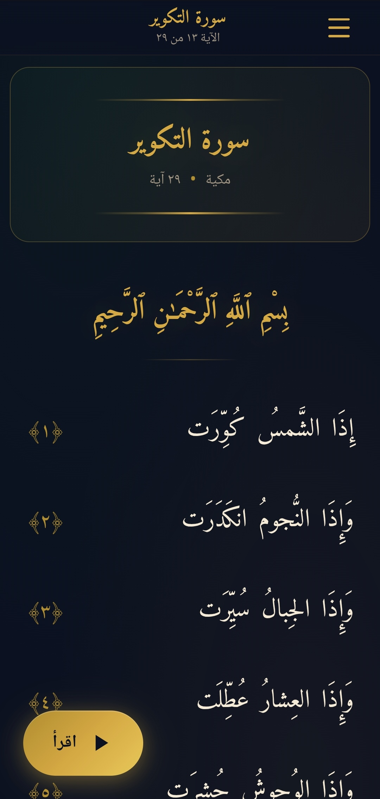
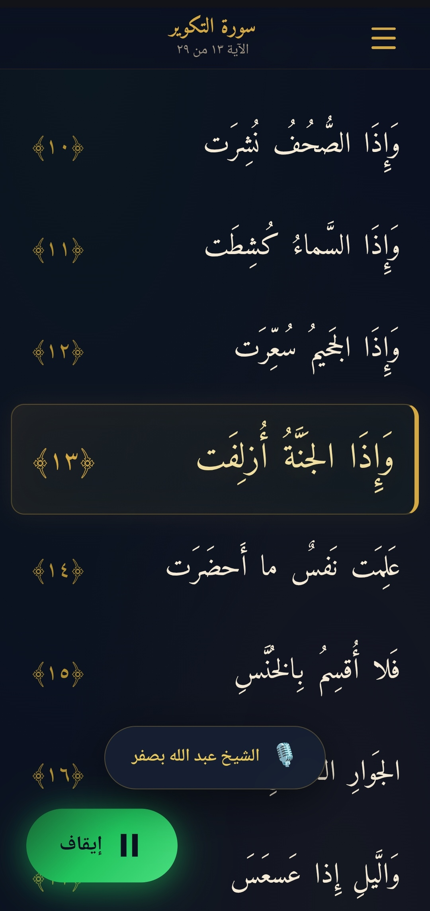
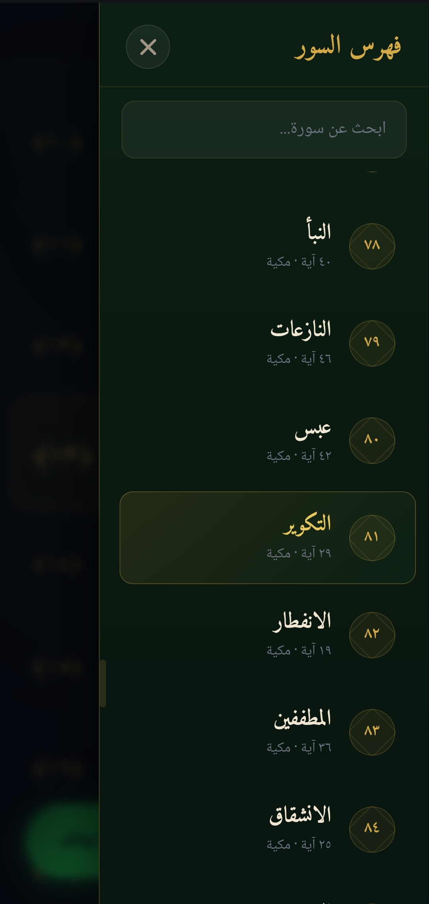

# Quran_Minimalist-Display
ı use for quran-text (https://github.com/amrayn/quran-text) and quran tilawat from (https://everyayah.com/data/Abdullah_Basfar_192kbps/) there are ""000_versebyverse.zip"" 2GB zip folder extract and put (asset/audio/xx.mp3)
then you can strat to  use it
 

 

